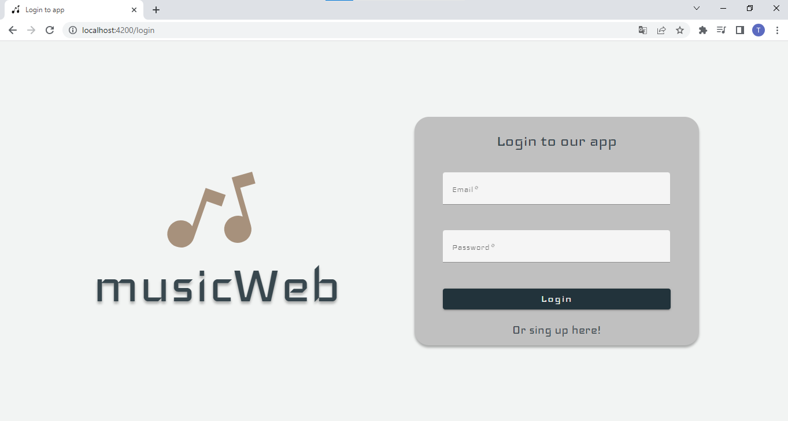
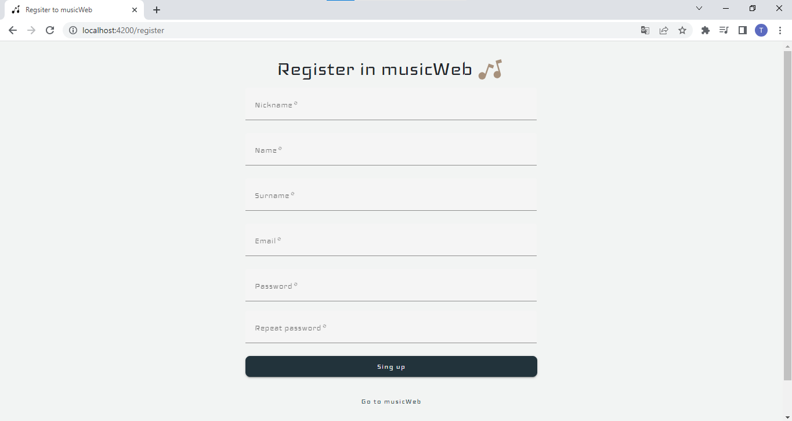
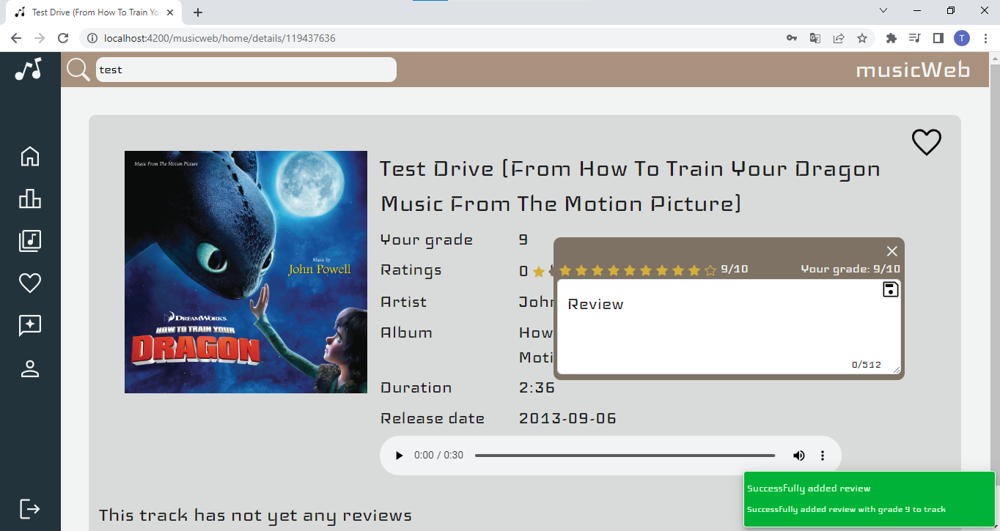
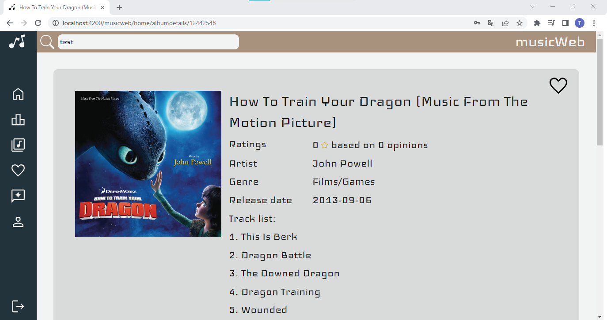
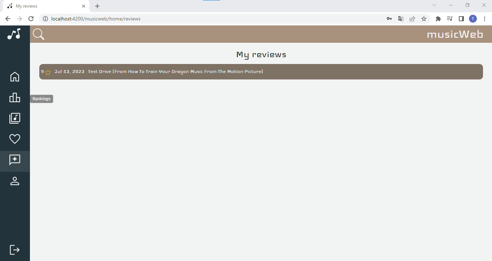
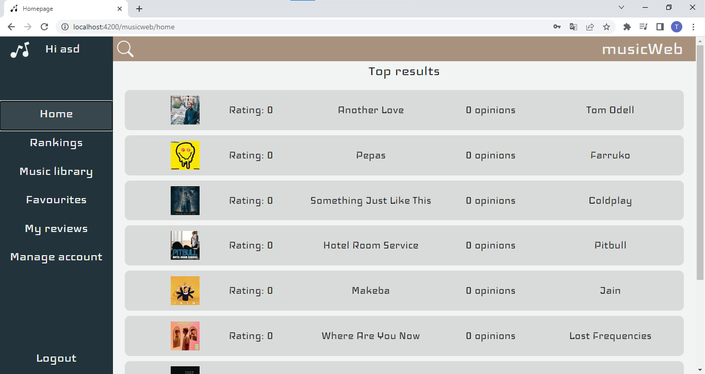

# Musicweb

## Table of Contents
* [General Info](#general-information)
* [Technologies Used](#technologies-used)
* [Features](#features)
* [Screenshots](#screenshots)
* [Usage](#usage)
* [Project Status](#project-status)
* [Contact](#contact)


## General Information
- Project uses Deezer API to fetching information about songs and albums which logged user can rate and add comments to them. Based on this rates page display dynamic rankings. User can add albums and song to favourties.


## Technologies Used
- Angular - version 15
- Springboot
- Docker - version 3.8


## Features
List the ready features here:
- Searching tracks
- Searching tracks and albums and filtering results
- Viewing rankings songs, albums and seeing it's reviews
- Regitster in app
--- For logged users
- Add rating and reviews
- Change users info data
- Deletion of account
- Add tracks and albums to favourites
- Displying all reviews


## Screenshots








.


## Usage
- Search for tracks and albums
- See their details
- Display ranking of them
- Register to app
- Login with your account
- Add track or album rate
- Add track or album review 
- Add track or album  to favourites

## Launch locally using Docker:

```
version: "3.4"

services:
  angular:
    image: andrzejsasak/pzespolowy-frontend
    ports:
      - "4200:4200"
  springboot:
    image: andrzejsasak/pzespolowy-backend
    ports:
      - "8080:8080"
```

## Project Status
Project is: _finished_ 


## Contact
Created by Tomasz Stolarz, Andrzej Sasak, Konrad Stolarz - feel free to contact me!


